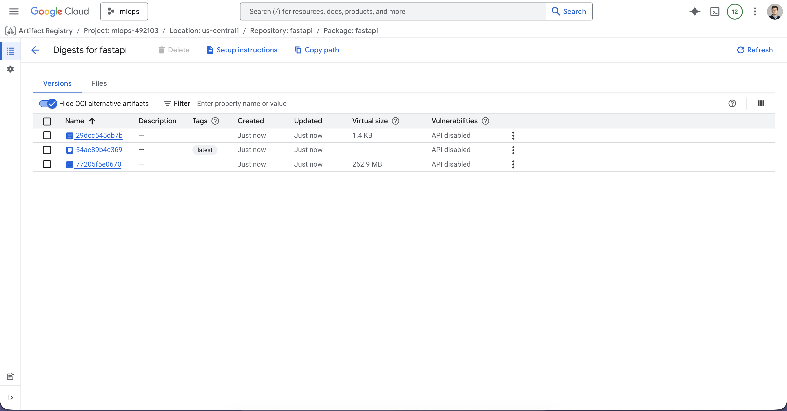
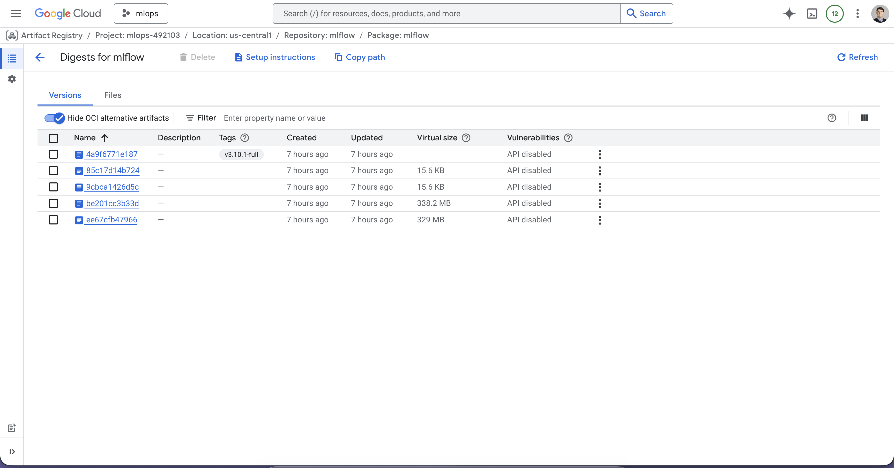
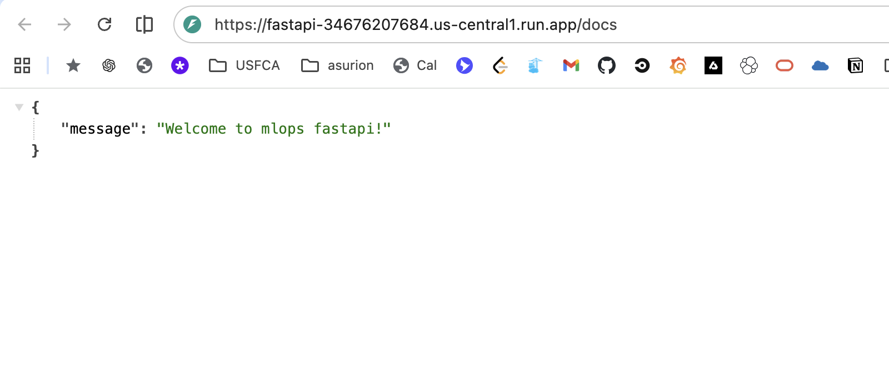

# Submission Milestone 2

## Deploying ML Model as a Web Service

1. GitHub repository
Link to your full repo, including all your code, Dockerfile, etc.  

https://github.com/igomez10/mlops

- FastAPI Dockerfile: https://github.com/igomez10/mlops/blob/main/Dockerfile.fastapi
- MLFlow Dockerfile: We pulled and pushed the official image, so no custom Dockerfile is needed. See Makefile for details: `make push-mlflow`.

○  Direct link(s) to the file(s) where endpoints are defined 

The FastAPI endpoints are defined in `server.py`:
https://github.com/igomez10/mlops/blob/main/server.py

2. Docker image proof
○  Screenshot showing your published image in the registry:





○  Image name must match what is used in your code

In `docker-compose.yml`, we reference the FastAPI image as `us-central1-docker.pkg.dev/mlops-492103/fastapi/fastapi:latest`, which matches the image we pushed to the registry.

3. Run instructions (important for grading)  In your repo README, include:
○  How to run the API locally (without Docker, if possible)

```bash
MLFLOW_TRACKING_URI=https://mlflow-34676207684.us-central1.run.app MLFLOW_MODEL_URI=runs:/6736c234459f44769f3475477b730f89/model  make run-fastapi
```

○  How to build and run the Docker container:

```bash
make build-fastapi
make start-docker-compose
```

## MLflow Team Server Setup on GCP

For this setup we used terraform to provision the necessary infrastructure on GCP, including a Cloud Run service for MLflow and a Cloud Storage bucket for artifact storage. 
The MLflow server is configured to use the Cloud Storage bucket as its backend store.
The first request will be slow as the service needs to spin up, but subsequent requests will be faster.

We opted for Cloud Run because we can define the entire infrastructure, including the configuration,
in our repo and embrace llms for managemenet. We can also integrate alerts/monitoring etc as
first class citizens in our setup. We can also overprovision our service during usage and scale to 0 when we dont use.
When working with the VM initially we noticed that the vm suggested was not powerful enough to run run a smooth setup and
docker commands will often hang.

We expect this extra effort in the second milestone will pay its dividends in the next milestones as 
management and adding more services will happen in cloud run too.

To comply with any milestone requirements we also setup a vm with mlflow here http://136.119.90.5:5000/
But we expect to use cloud run for the next milestones as we can integrate monitoring/alerting and forger about
infrastructure management and running daily operations.

MLFlow server running on Cloud Run:
https://mlflow-34676207684.us-central1.run.app/#/experiments/467518636860402424/runs/6736c234459f44769f3475477b730f89

### Example of how to call the FastAPI endpoint:

This is a demo model for sqft and rooms but this is just a dummy to show an example. We will migrate to other models related to our project.



Example request:
The first request will be slow as the service needs to spin up, but subsequent requests will be faster.

```bash
curl -X POST https://fastapi-34676207684.us-central1.run.app/predict \
-H "Content-Type: application/json" \
-d '{"sqft": 1500, "rooms": 3}'

{"prediction": 1234}
```
